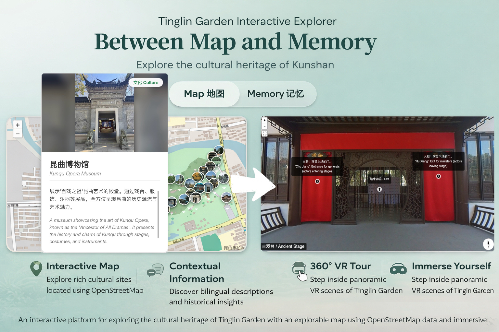
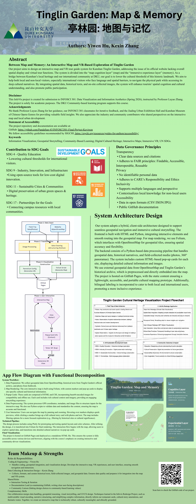

# INFOSCI301-Final-Project-Keviwen
## Tinglin Garden: Between Map & Memory | 亭林园：地图与记忆 · INFOSCI301 Final Project

**Authors:** Lydia Hu, Kelsey Zhang

### Teaser Figure:



## Abstract


Tinglin Garden: Between Map & Memory is an interactive spatial visualization project that explores the cultural landscape of Tinglin Garden (亭林园), Kunshan. It develops an interactive map and browser-based panorama system for Tinglin Garden in Kunshan. Our motivation is to address the limitation of the official website, which lacks spatial visualization and virtual exploration. Our project combines a map layer for spatial navigation with a 360° panorama layer for experiential exploration. The primary target audience includes local residents, university students at Duke Kunshan University (DKU), and other international visitors, particularly those who face language and spatial barriers when engaging with local cultural heritage. We provide bilingual site descriptions and structured spatial navigation to make Tinglin Garden more accessible to a diverse community. Our visualization combines landmark data (including geographic coordinates, bilingual metadata, and categorized cultural sites), OpenStreetMap basemaps, structured popup cards with images, and interconnected panoramic scenes rendered using Pannellum. Through this prototype, we hope to support informal cultural learning, improve spatial understanding of the park, and promote broader engagement with local heritage in a digitally accessible format.

The entire system is deployed via GitHub Pages, requiring no backend.

## Academic Professional Block

### Disclaimer

This InfoVis project is created for submission to INFOSCI 301: Data Visualization and Information Aesthetics (Spring 2026), instructed by Professor Luyao Zhang. The project is for academic purposes. The DKU Community-based learning program supports this course.

### Acknowledgments

We would like to thank Professor Luyao Zhang for her guidance, our INFOSCI 301 classmates for their iterative feedback, and the Jiading District Urban Planning Exhibition Hall, Fengxian Waving Cube Sci-Fi Immersive Museum and Kunshan Museum of Chinese Opera Genres (Kunqu Opera Living Heritage), and other industry contributors for providing valuable field insights during data collection. 

### Contribution to SDG Goals

- SDG 4 Quality Education: Our project provides a bilingual, interactive map and 360° panorama interface that supports informal cultural learning. It also enhances users’ understanding of Tinglin Garden’s historical and cultural background in an accessible digital format.

- SDG 9 Industry, Innovation, and Infrastructure: This project demonstrates the application of open-source web-based visualization tools (Folium and Pannellum) to cultural heritage presentation. It contributes a lightweight, browser-based solution that improves digital accessibility without requiring specialized infrastructure.

- SDG 11 Sustainable Cities and Communities: By digitally documenting key cultural landmarks and organizing them into a structured map, this project supports the preservation of local cultural heritage. It also promotes broader public access to urban cultural resources through an online platform.

- SDG 17 Partnerships for the Goals: Through a bilingual interface and engagement with local cultural content, the project facilitates cross-cultural access and dialogue between local heritage sites and the international academic community at DKU.

### Statement of Accessibility 

The project repository and documentation are available at: GitHub: https://github.com/PandaSun-43/INFOSCI301-Final-Project-Keviwen

Hugging Face Dataset: https://huggingface.co/datasets/Butterflywen/info301-final

We follow accessibility guidelines recommended by SIGCHI: https://sigchi.org/resources/guides-for-authors/accessibility/

🗺️ Interactive demo URL:

👉 **Start from our dashboard:**  https://pandasun-43.github.io/INFOSCI301-Final-Project-Keviwen/dashboard.html

👉 **Open the interactive tour:**  https://pandasun-43.github.io/INFOSCI301-Final-Project-Keviwen/app.html 

## Embedded Multimedia Assets

### Keywords:

Information visualization; Geospatial storytelling; Community-based learning; Cultural mapping; Interactive map; 360° panorama; UN SDG goals

### Teaser Video:


https://duke.zoom.us/rec/share/eIus6x9Ql7GaRMdIipUkUk9lDg-ShebbRaK28rNLw2orAvo4T0sAc0Tj1rJPsVi-.3np_yDBJsuFShx5N

- Explanation: The video presents the “Tinglin Garden: Between Map and Memory” project, which integrates cultural heritage with modern technology by offering an interactive map and 360° panoramic experience of Tinglin Garden in Kunshan, China. The project addresses the limitations of the official website, which lacks interactive spatial tools, by providing a dynamic map based on OpenStreetMap data and immersive panoramic views. This integration enhances user engagement and accessibility to the garden’s cultural assets. The video also demonstrates the user experience and concludes with acknowledgments to Professor Luyao Zhang for her guidance, as well as the feedback from classmates and insights from local field partners.

### Canva Poster:


https://www.canva.com/design/DAHA0Gu_rUk/Emvd0Qnb-Ewk70zy2ekClA/edit?utm_content=DAHA0Gu_rUk&utm_campaign=designshare&utm_medium=link2&utm_source=sharebutton

- Explanation:  This poster presents “Tinglin Garden: Map & Memory”, an interactive map and a 360° panorama tour to provide users with an engaging way to explore the garden’s history and architecture. By integrating open data and historical content, the system bridges cultural gaps, supports education, and promotes cultural preservation. It aims to enhance visitor engagement through multi-language support and interactive features, aligning with key SDGs such as Quality Education, Industry Innovation, and Sustainable Communities.


## ✨ Key Features

🗺 **Interactive Cultural Map (Folium-based)** 

- Geolocated heritage sites: All heritage locations are mapped using real geographic coordinates and rendered through Folium.

- Bilingual popup cards (CN/EN): Each site has bilingual descriptions to improve accessibility for both local and international audiences.

- Thematic categorization: Cultural sites are organized into thematic layers (e.g., Pavilions, Museums, Gardens, Monuments), supporting structured exploration and comparative viewing.

👓 **Web-based 360° Panorama Exploration**

- 360° panorama viewing (Pannellum): Equirectangular images are rendered client-side using a lightweight JavaScript viewer.

- Scene-to-scene navigation: Spatial transitions are implemented through interactive hotspots, allowing users to move between connected locations.

- Lightweight browser-native implementation: The VR component runs entirely in standard web browsers without requiring additional software or hardware.  

📍 **Spatial Narrative Structure**

- Each location as narrative unit: Each mapped site functions as an informational node combining spatial position and cultural context (pop-up card).

- Story-informed spatial linking: Cultural landmarks are connected through interpretive descriptions to encourage contextual understanding.


🌳 **Dual Interaction Modes**

- Analytical exploration (Map interface): The map interface supports spatial comparison and infomation understanding.

- Experiential exploration (Panorama interface): The 360° interface supports embodied spatial perception and environmental immersion.

These two modes provide complementary perspectives on the same cultural dataset.

🌐 **Static Web Architecture**

- Client-side implementation only: The project is implemented entirely using HTML, CSS, JavaScript, and Python preprocessing.

- No backend or database dependency: All assets are served as static files, enabling deployment on platforms such as GitHub Pages.

- Portable and reproducible structure: The project can be cloned and deployed without server configuration.


## 🛠️ Technical Workflow

#### **1. Data Processing (Python)**
- Manually curated landmark dataset
- Bilingual metadata encoding (CN/EN)
- Thematic classification (Pavilion, Museum, Monument, Garden…)
- Image asset organization

Output structured inputs for Folium map generation.

#### **2. Interactive Map Construction (Folium)**
- Basemap rendering (OpenStreetMap)
- Category Identification and Marker
- Custom HTML/CSS popup cards
- Embedded image previews
- Export standalone HTML file

#### **3. Immersive VR Layer (Pannellum)**
- 360° panorama capture
- Scene configuration (scene1–sceneN)
- Scene linking via hotspot navigation
- Lightweight browser-based rendering

Pannellum enables browser-based 360° panorama interaction without requiring additional software installation.

#### **4. Deployment**
- Static HTML export
- Asset folder structuring
- GitHub Pages hosting

## 🌍 UN SDG Contributions

| Goal | Contribution |
|------|--------------|
| **SDG 4 – Quality Education** | Accessible bilingual cultural learning through spatial storytelling |
| **SDG 9 – Industry, Innovation & Infrastructure** | Application of open-source web-based visualization tools |
| **SDG 11 – Sustainable Cities & Communities** | Digital preservation of urban cultural heritage |
| **SDG 17 – Partnerships for the Goals** | Linking university research with local cultural memory |

## 🏛 Conceptual Framework
This project conceptualizes:

- The garden as an interactive spatial system

- The map as a cognitive navigation structure

- The panorama as a site-specific experiential layer

Rather than treating heritage sites as isolated points, the project models Tinglin Garden as a network of spatially connected cultural nodes.

## 📁 Repository Structure

```plaintext
INFOSCI301-Final-Project-Keviwen/
│
├── dashboard.html (Project Entry Page, Brief introduction and SDG alignment)
├── app.html (Main Interactive Interface)
├── detail_robot.html (Dedicated page for the “Robot Drink Service” site.)
├── tinglin_map_with_tours.html (interactive map output.)
├── tinglin_map.ipynb (Data Preprocessing Notebook)
│
├── pictures/ (All images used in popup cards)
│
├── VR/ (Panorama image assets, Memory-specific HTML files)
│   ├── dragon/
      └── memory_dragon.html
      └── images
      └── scenes.js
      └── main.js
      └── style.css
    ├── guyanwu/
      └── memory_guyanwu.html
      └── images
      └── scenes.js
      └── main.js
      └── style.css
│   ├── kunqu/
      └── memory_kunqu.html
      └── images
      └── scenes.js
      └── main.js
      └── style.css
│   ├── ...
│
└── README.md
